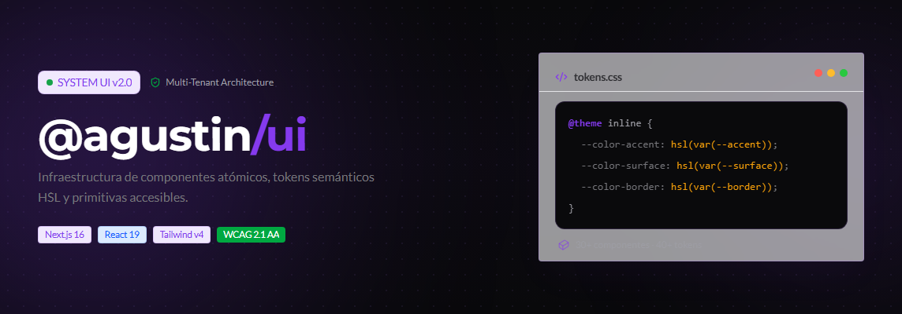
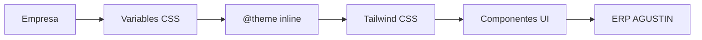

<div align="center">



<br>

# 💜 @agustin/ui

### Sistema de Diseño • Librería UI • Visual Runtime

Infraestructura visual oficial del **ERP AGUSTIN (AGAI / AgStudios)**

Construido con **React 19**, **Next.js 16**, **Tailwind CSS v4**, **TypeScript** y **Radix UI**

> Componentes reutilizables • Tokens semánticos • Multi-Tenant • React Server Components • Accesibilidad WCAG 2.1 AA

<br>


</div>

---

# Tabla de Contenido

- [¿Qué es @agustin/ui?](#-qué-es-agustinui)
- [¿Por qué existe?](#-por-qué-existe)
- [Principios](#-principios)
- [Arquitectura](#-arquitectura)
- [Contrato Visual](#-contrato-visual)
- [Características](#-características)
- [Quick Start](#-quick-start)
- [Instalación](#-instalación)
- [Sistema de Temas](#-sistema-de-temas)
- [Organización](#-organización)
- [Documentación](#-documentación)
- [Roadmap](#-roadmap)
- [Contribución](#-contribución)
- [Licencia](#-licencia)

---

# ¿Qué es @agustin/ui?

`@agustin/ui` es el Sistema de Diseño oficial del ERP **AGUSTIN**.

Más que una librería de componentes, constituye una infraestructura visual diseñada para construir aplicaciones empresariales consistentes, escalables y accesibles.

Toda la identidad visual se abstrae mediante **tokens semánticos**, **variables CSS HSL** y **Tailwind CSS v4**, permitiendo que múltiples organizaciones compartan una misma base de código sin modificar los componentes.

---

# ¿Por qué existe?

Antes de `@agustin/ui`, cada módulo del ERP evolucionaba con componentes y estilos propios.

Esto provocaba:

- Componentes duplicados
- Inconsistencias visuales
- Alto costo de mantenimiento
- Dificultad para incorporar nuevos clientes
- Tematización compleja

`@agustin/ui` centraliza toda la infraestructura visual del ERP para ofrecer una única fuente de verdad.

---

# En números

| | |
|:---|:---:|
| Componentes | **30+** |
| Utilidades | **2+** |
| Tokens | **40+** |
| TypeScript | **100%** |
| React Server Components | ✅ |
| Multi-Tenant | ✅ |
| Dark Mode | ✅ |
| WCAG 2.1 AA | ✅ |

---

# Principios

## Diseño Semántico

Los componentes nunca conocen colores.

Siempre utilizan tokens.

```tsx
className="bg-accent"
```

Nunca:

```tsx
className="bg-purple-600"
```

---

## Multi-Tenant

Cada empresa define únicamente sus variables HSL.

Los componentes permanecen idénticos.

---

## Server First

La librería prioriza React Server Components para minimizar JavaScript en cliente.

---

## Accesibilidad

Todos los componentes cumplen WCAG 2.1 AA y utilizan primitivas accesibles de Radix UI.

---

## Consistencia

Todos los módulos del ERP comparten:

- Componentes
- Tipografía
- Espaciados
- Sombras
- Tokens
- Estados
- Interacciones

---

# Arquitectura



---

# Contrato Visual

```
:root
   │
   ▼
Variables CSS

--background
--surface
--accent
--text-primary
--border-default
--border-strong

   │
   ▼

tokens.css

   │

@theme inline

   │

Tailwind CSS

   │

bg-background

text-accent

border-border-default

   │

Componentes
```

---

# Filosofía

❌ Nunca

```tsx
<Button className="bg-purple-600" />
```

✅ Siempre

```tsx
<Button className="bg-accent" />
```

---

❌ Nunca

```css
color:#7c3aed;
```

✅ Siempre

```css
color:hsl(var(--accent));
```

---

❌ Nunca

```css
background:#ffffff;
```

✅ Siempre

```css
background:hsl(var(--background));
```

---

# Características

- React 19
- Next.js 16
- Tailwind CSS v4
- TypeScript
- Radix UI
- Multi-Tenant
- Dark Mode
- Light Mode
- SSR
- React Server Components
- WCAG 2.1 AA
- Tree Shaking
- Tokens Semánticos
- Compound Components
- Headless UI

---

# Instalación

```bash
pnpm add @agustin/ui
```

---

## Peer Dependencies

```text
react >=18

react-dom >=18

next >=14

tailwindcss >=4

typescript >=5

node >=20

next-themes

lucide-react

@radix-ui/*
```

---

# Quick Start

```tsx
import { Button, TooltipProvider } from "@agustin/ui";

export default function Page() {
  return (
    <TooltipProvider>
      <Button>
        Crear Orden de Compra
      </Button>
    </TooltipProvider>
  );
}
```

---

# Sistema de Temas

El sistema utiliza un contrato basado en variables HSL.

```css
:root{

--tenant-hue:265;

--tenant-saturation:84%;

}
```

Estas variables alimentan `tokens.css`, el cual genera automáticamente los alias utilizados por Tailwind CSS.

---

# Organización del Proyecto

```text
src/

├── components/
│   Componentes compuestos
│
├── primitives/
│   Componentes base reutilizables
│
├── theme/
│   ├── tokens.css
│   └── index.ts
│
├── utils/
│
└── index.ts
```

---

# Documentación

| Documento | Descripción |
|------------|-------------|
| ARCHITECTURE.md | Arquitectura |
| THEMING.md | Sistema de Tokens |
| COMPONENTS.md | Componentes |
| UTILS.md | Utilidades |
| CONTRIBUTING.md | Convenciones |
| DEVELOPMENT.md | Desarrollo |

---

# Contribución

Todo nuevo componente debe cumplir las siguientes reglas:

- Consumir únicamente tokens semánticos.
- Utilizar `cn()` para combinar clases.
- No utilizar colores HEX.
- No utilizar colores RGB.
- Mantener compatibilidad con React Server Components.
- Implementar accesibilidad por defecto.
- Utilizar el Focus Ring corporativo.

Las convenciones completas se encuentran en `CONTRIBUTING.md`.

---

# Licencia

Licencia propietaria.

Todos los derechos reservados.

© **AGAI · AgStudios**